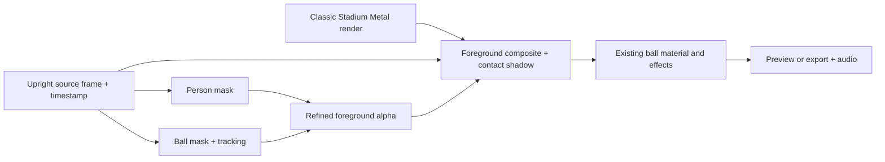

# First replacement environment: Classic Stadium

Status: first foreground/camera study and an [in-app preview](stadium-app-preview.md) implemented. See [study results](foreground-study.md). The saved editor preset, final stadium port and export integration remain subsequent stages.

## Decision

Build one complete replay/export experience using Apple Vision for person segmentation, the existing ball detector plus a separately refined ball mask, and native Metal for the stadium and compositing. Start with a single player, full-body footage, and a stationary phone. Background replacement during live recording is a later milestone.

The first deliverable is a real juggling clip with the original player and ball composited into Classic Stadium, retaining existing ball effects and original audio. A standalone scene alone does not complete the milestone.

## What was inspected

React Native source: `hewad-mubariz/react-native-motion-lab`, commit `ba9b8e4872dfef26c2b34902f966e9c3e4511a00`, `src/scenes/stadium-selection/scene.ts` (1,307 lines).

It uses `three/webgpu` and `THREE.WebGPURenderer`, supplied with a device/context by `useWebGPU.ts` from `react-native-wgpu`. It is a procedural 3D seat-selection scene, rather than a single standalone WGSL background shader.

Reusable building blocks:

- `superEllipsePoint` and `makeSweptProfileGeometry`: stadium bowl and tiers.
- `makePitchTexture`: grass stripes and pitch markings, currently generated as a 1056 × 704 texture over a 66 × 44 plane.
- `makeGoal`: post/crossbar geometry; add net geometry/material for the close pitch-level view.
- `makeFarSeatGeometry` and `makeSeatPatternTexture`: efficient distant seating.
- Existing colors, fog and lighting are useful starting references, not a finished photographic match.

Leave out the 28 × 45 × 48 seat slots, individual-seat animation, selection state, pricing, hit testing and section-orbit camera. Use the distant seat representation from the start. Build permanent buffers once.

Dawn has a Metal backend, but that does not make the Three.js TypeScript scene executable in Swift. Port the geometry generation, camera math and material intent. Use native Metal pipelines instead of introducing the React Native/Three.js/Dawn runtime into Juggle Dude.

Juggle Dude already supplies:

- `MetalVideoSurface.swift`: decoded video frames and their presentation timestamps.
- `MetalEffectEngine.swift` / `EffectShaders.metal`: preview/export GPU rendering.
- `EffectVideoGeometry.swift`: upright orientation, SDR normalization and aspect-fill mapping.
- `BallEffectTrack.swift` / `BallVisualRefiner.swift`: tracked ball position/size and local visual refinement.
- `BallStyleBurnIn.swift`: sequential decoding, encoding, progress and source-audio preservation.
- Optional person boxes in `RecordedFrame`; these are rectangles, not cutout masks. The video analyzer currently stores these with ball-detection frames, so they are not a complete person-mask timeline.

The existing Nightfall environment is a color grade. Keep its behavior separate from a new background-scene selection.

## Foreground extraction choice

Start with `VNGeneratePersonSegmentationRequest`. Benchmark `.balanced` and `.accurate` against the actual park and indoor clips, then use the chosen quality consistently in the cached replay/export path. Apple's guidance distinguishes video frame-by-frame processing from still-quality processing; do not assume the highest setting is automatically best for video.

Generate masks before adding effects, ball skins or scene grading. Decode and process frames in presentation-time order off the UI thread. Reuse the request within a sequence; reset on a new source or a discontinuity. Request reuse alone is not a guarantee that every quality mode has flicker-free motion.

For wide footage where the player occupies little of the image, evaluate a padded, temporally stable person crop using the detector's person box. Preserve the complete limbs, map the mask back to the full upright image, and record that transform. Reacquire missing person boxes independently of the ball track when necessary.

Compare against simple backgrounds and the actual stadium, paying attention to shoes, moving legs, fingers, hair, holes between limbs and motion blur. Use edge-aware upsampling, conservative edge cleanup and motion-aware temporal refinement where the footage demonstrates a need. Heavy blur or unconditional blending of consecutive masks creates halos and ghost limbs.

OpenCV background subtraction is designed around a background model and static cameras. It does not by itself provide the semantic player cutout we need. OpenCV could support image processing, but adding it is unnecessary for the first native version.

`VNGenerateForegroundInstanceMaskRequest` is a useful experiment for ball/object extraction, not an assumed reliable video tracker. It is image-based, resource intensive, and its instance identifiers are not stable tracking identities. Evaluate it on a padded ball crop, matched to the detector, before deciding to use it per frame or at selected frames.

If Vision cannot retain the player's moving limbs acceptably, pause scene expansion and evaluate a video-matting model through Core ML. That decision should follow the quality benchmark, not precede it.

## Preserve the actual ball

Person segmentation cannot be relied on to include a detached football. This must be solved explicitly.

1. Use the refined detector center and physical radius to locate the ball in the original frame.
2. Prototype a soft geometric ball mask as a debugging baseline only.
3. Refine its boundary against the source crop, retaining motion-blurred pixels where supported. Compare the local edge method against foreground-instance segmentation on difficult crops.
4. Combine the player mask and visible-ball mask with `max(personAlpha, ballAlpha)` before extracting source pixels. Since both use the same source frame, overlapping regions retain the original player/ball occlusion.
5. Track validity must follow actual observations. Do not cut out a stale circle at a guessed location during a long gap, and do not fill in an imagined ball hidden behind a leg.

A visible ball disappearing, or a circular patch of original grass traveling with it, fails the first milestone. If the baseline cannot meet this, improve ball segmentation before treating the feature as ready. Existing ball skins must not be used to hide the failure.

## First scene art direction

Classic Stadium, with neutral daylight/late-afternoon lighting suited to the source clips:

- Ground-level portrait camera, green pitch, readable perspective markings and a goal behind the player.
- Curved lower/upper stands, distant seat detail, stadium rim, floodlight structures and restrained atmospheric depth.
- Improved grass surface detail and a proper goal net; the existing seat-view texture was authored for a different viewing distance.
- Mild atmosphere animation driven by video time. Per the follow-up request, support a restrained 3D camera move with consistent foreground reprojection; retain a locked comparison mode.
- Match horizon and ground placement to the footage. Estimate a stable ground anchor from planted feet over time; do not move the ground line with the raised juggling foot. Offer simple horizon/ground adjustment if the estimate is poor.
- A soft approximate contact shadow on the new pitch. It should fade appropriately when feet are off the ground; no unsupported claim of recovered 3D lighting.
- Subtle foreground exposure/temperature matching, preserving skin and clothes.

The player remains a 2D cutout. Use a calibrated subject plane and the same virtual camera for foreground, pitch, goal and stands. Small lateral/dolly movement creates depth parallax; large orbits expose missing body views. The first study implements a small deterministic move. Recovering handheld source-camera motion and better depth are subsequent work, not completed by this approximation.

After Classic Stadium works, reuse its mesh for Night Stadium with a different sky, lights and materials. Sunset can reuse pitch assets, but the open field/skyline is a separate scene variant, not simply a tint change.

## Rendering and cache contract

Use one `SessionVideoCompositor` to orchestrate the passes for replay, still previews and export. The stadium renderer produces an offscreen `MTLTexture` using the same `MTLDevice`; the existing effect renderer consumes the composited video texture. Counter/UI overlays remain last. Preserve current effect ordering for v1; mask-derived foreground depth cannot resolve every behind/in-front effect interaction.

Perform blending in a consistent linear color space, then convert/tone-map once for SDR delivery. Do not independently apply the old Nightfall grade to the whole newly rendered scene without defining the intended result.

Masks live in source-upright coordinates. Apply the same crop/orientation transform to video, masks, ball coordinates and ground anchor. Preview and export share the scene framing and media timestamp; wall-clock or display-refresh time must not affect the scene.

On first selecting Classic Stadium, prepare the foreground cache with progress and cancellation. Cache per-frame masks against source identity, presentation timestamp, orientation, dimensions, request revision, quality and refinement version. Cache disk data in bounded chunks and retain only a small nearby frame window in memory. Changing a scene or ball effect reuses this work.

Store the final refined masks so seeking does not produce different temporal results. Never pair a newly decoded source frame with a previous frame's stale mask. For an unprepared frame, wait/prepare or clearly keep Original; do not silently export an incorrect composite. The prototype must test failure and cancellation explicitly.

The stadium may reuse its static color/depth buffers while the camera and lighting stay fixed; small animated atmospheric passes can update separately. Masks and scene passes are full-frame work and must not inherit the ball effect's restricted render region.

## Implementation sequence and review gates

| Step | Changes | Reviewable result |
| --- | --- | --- |
| 1. Cutout feasibility | Mask extraction harness, balanced/accurate comparison, ball boundary experiment, source-coordinate mapping | Park and indoor clips over checkerboard/contrasting colors; moving legs and detached ball survive |
| 2. Scene port | Native meshes from the RN generators, pitch materials, goal net, lighting, calibrated moving camera | Classic Stadium rendered to a Metal texture at preview and export sizes |
| 3. Integration | Shared compositor, ground alignment, contact shadow and restrained color matching | Original vs stadium video with the real player, original ball and one existing effect |
| 4. Editor | Add Original / Classic Stadium background choice, preparation state and cancellation; keep lighting grade separate | Select, prepare, scrub, switch effect, return to Original without redoing masks |
| 5. Export and validation | Consume the same cached masks and scene parameters from `BallStyleBurnIn` | Full 1080p export with original audio, verified against preview |

Proposed files:

- `kicklab/Environments/EnvironmentScene.swift`: original/classic scene identity, camera and light parameters.
- `kicklab/Environments/StadiumMeshBuilder.swift`: native procedural meshes and static buffers.
- `kicklab/Environments/StadiumSceneRenderer.swift` / `StadiumShaders.metal`: scene color/depth rendering.
- `kicklab/Environments/ForegroundMaskProcessor.swift`: ordered person/ball processing and refinement.
- `kicklab/Environments/ForegroundMaskCache.swift`: versioned timestamp-indexed cache.
- `kicklab/Environments/SessionVideoCompositor.swift` / `ForegroundComposite.metal`: common pass orchestration and blending.
- Adapt `SessionEditState`, `MetalVideoSurface`, `BallStyleBurnIn` and environment picker options to pass the same scene/cache state.

## Completion criteria

- Inspect park and indoor video, including fast kicks, ball separation, foot overlap, tracking gaps and source orientation changes.
- No visible missing feet, detached balls or persistent original-background halos on the supported test clips; evaluate full-speed motion and enlarged crops, not only stills.
- Ground/contact shadow stays stable while one foot rises.
- Original remains the original footage; current effects and counting retain their behavior.
- Preview and export use identical mask/scene timestamps and agree within expected scaling/encoding differences.
- Pausing/seeking reproduces the same prepared frame. Cancellation and failures cannot be reported as a successful edited export.
- Verify full video decode, duration/frame count and preserved audio.
- Measure mask preparation time, cached playback frame time, peak memory, export speed and sustained thermal behavior on a physical iPhone. A 30 fps cached-preview target is a target until measured, not a simulator-derived guarantee.

The first study provides the step 1 review artifact and a small camera prototype. Edge quality and camera calibration still need review before shipping the environment preset.

## Sources

- [Inspected stadium implementation](https://github.com/hewad-mubariz/react-native-motion-lab/blob/ba9b8e4872dfef26c2b34902f966e9c3e4511a00/src/scenes/stadium-selection/scene.ts)
- [React Native WebGPU](https://wcandillon.github.io/react-native-webgpu/)
- [Dawn backend overview](https://dawn.googlesource.com/dawn/+/refs/heads/main/README.md)
- [Apple: applying matte effects to people in images and video](https://developer.apple.com/documentation/vision/applying-matte-effects-to-people-in-images-and-video)
- [Apple: person segmentation quality, video processing and capture guidance](https://developer.apple.com/videos/play/wwdc2021/10040/)
- [Apple: foreground instance segmentation and instance semantics](https://developer.apple.com/videos/play/wwdc2023/10176/)
- [OpenCV: background subtraction methods](https://docs.opencv.org/4.x/d1/dc5/tutorial_background_subtraction.html)
